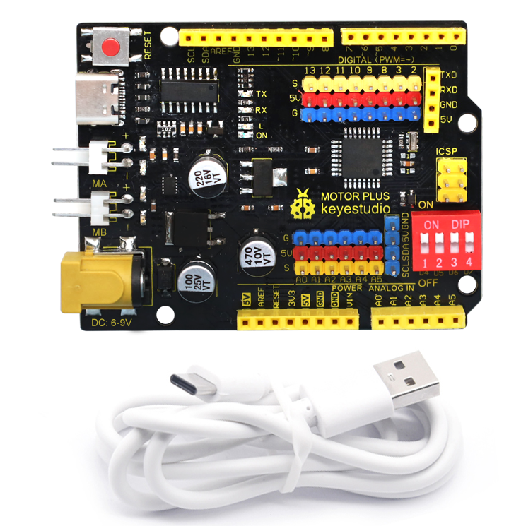
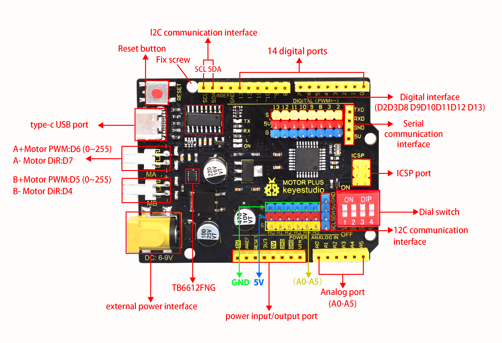
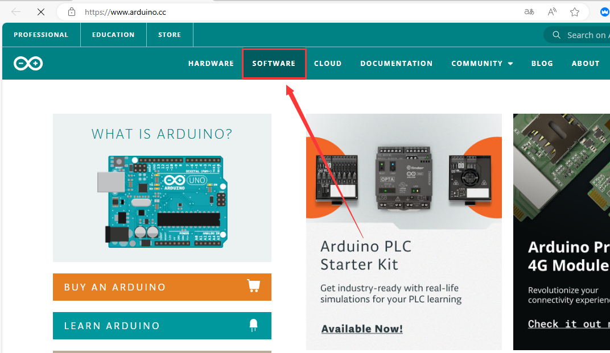
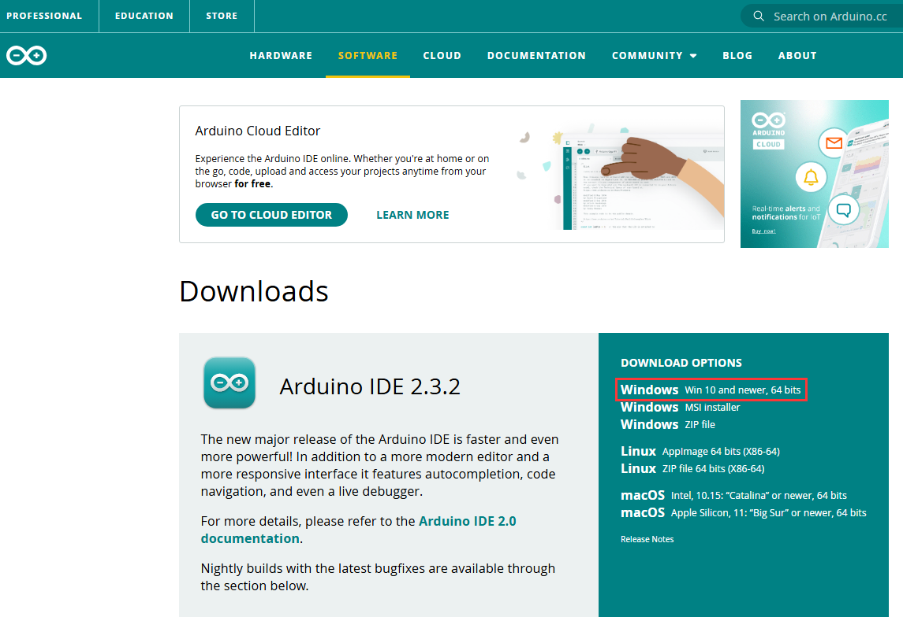
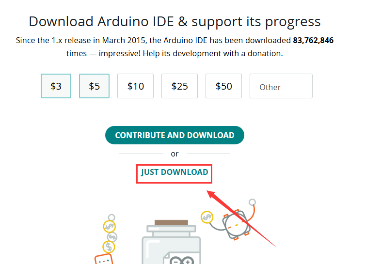
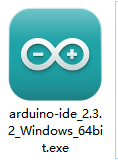
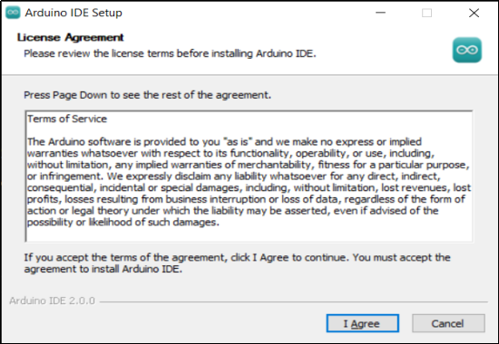
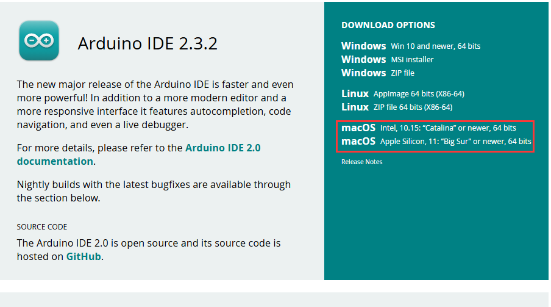
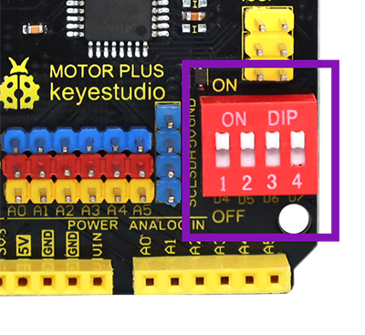
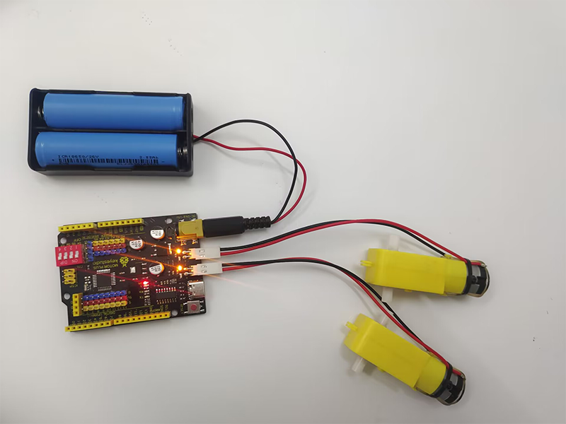

# keyestudio 328P Development Board+ Motor Drive (DRV8835)




## 1. Description

When we do DIY electronic product experiments, we often program on the Arduino IDE with Arduino series microcontrollers. 

This control board is fully compatible with the Arduino IDE development environment. It contains all the functions of the UNO R3 board. On its basis and for convenience, we optimize the board with two DC motor drive module, which can control one or two DC motors by DIP switch. 

It is perfect for platforms and systems that need to control two DC motors, as well as related applications that require high current output from IO ports. Thus, this improvement makes its functions more powerful. Details are shown below. 

In order to facilitate the connection, we also equipped a USB cable with a type-c interface of 1 meter in length.


## 2. Parameters

Microcontroller: ATMEGA328P-AU

USB-to-serial chip: CH340

Operating voltage: 5V

External voltage: DC 6-9V (9V is recommended)

Digital I/O pin: 14 (D0-D13)

PWM channel: 6 (D3 D5 D6 D9 D10 D11)

Analog input port(ADC): 8(A0-A7)

Dc output capability per I/O: 20 mA

Maximum output capability of a 5V port: 1.5A

Maximum power: 7.5W

Maximum output current of motor interface: 1.5A

Motor interface: 2P KF2510 2.54mm highly curved pin seat

Flash Memory: 32 KB (0.5 KB for bootstrap)

SRAM: 2 KB (ATMEGA328P-AU)

EEPROM: 1 KB (ATMEGA328P-AU)

Clock speed: 16MHz

On-board LED pin: D13

Weight: 25g

Dimensions: 75.6x53.5x14mm


## 3. Pin-out




##  4. Special Function Interfaces

Serial communication interfaces: D0 for RX, D1 for TX

PWM interface (pulse width modulation) : D3 D5 D6 D9 D10 D11

External interrupt interfaces: D2(interrupt 0), D3 (interrupt 1)

SPI communication interface: D10 for SS, D11 for MOSI, D12 for MISO, D13 for SCK

IIC communication ports: A4 for SDA, A5 for SCL


## 5. Arduino IDE on Windows

### 5.1 Install Arduino IDE

Install Arduino IDE first.

Arduino IDE official: [https://www.arduino.cc/](https://www.arduino.cc/), click  as follows;



Click `Windows Win 10 and newer,64 bit` to download and install the file.



Click `JUST DOWNLOAD`.



Click `JUST DOWNLOAD` again to download the package of `arduino-ide_2.3.2_Windows_64bit.exe`.


Downloaded: 



**Installation:**

Click package `arduino-ide_2.3.2_Windows_64bit.exe` and you will see an interface, please click `I Agree`.



Tick `Anyone who uses this computer (all users)`, and `Next`.


Click `Browse...` to choose a path for installation. Disk C is not recommended. After that, click `Install`.


Installed:


### 5.2 Install Board USB Drive

Please visit: 

[Install CH340 Driver on Windows System — Getting started with Arduino documentation (keyestudio.com)](https://docs.keyestudio.com/projects/Arduino/en/latest/windowsCH340.html)


## 6. Arduino IDE on MAC

### 6.1 Install Arduino IDE

Choose the macOS version of Arduino IDE, and its download method is similar to that of Windows.



Once the download is complete, click it and follow the prompts to install.

### 6.2 Install Board USB Drive

Please visit:

[Install CH340 Driver on MAC System — Getting started with Arduino documentation (keyestudio.com)](https://docs.keyestudio.com/projects/Arduino/en/latest/MacCH340.html)


## 7. Motor Drive

### 7.1 Introduction

Keyestudio Motor PLUS Development Board boasts on-board two-way motor drive IO ports. One or both of motors can be enabled by DIP switch, and their speed can be controlled by PWM output.

Motor A port pin: D5(PWM), D4.

Motor B port pin: D6(PWM), D7.

4 LED indicators are welded on the board. When driving the motor, indicator(s) will light up due to a positive voltage output. So the out indicator(s) means negative voltage. Because of this, we may determine the rotation direction of motors.

A DIP controls the connection of the signal pin of the motor. If the switch is upward, the connection between the signal and the motor driver ic are connected. On the contrary, downwards means a disconnection.

As follows:

<p style="color:red;">If the motor does not rotate after uploading the code, check whether this DIP switch is on.</p>



### 7.2 Wiring



### 7.3 Logic Table for Motor Control

| MA_E（D5）             | MA_P（D4）                 | MA motor state | MB_E（D6）             | MB_P(D7)                   | MB motor state |
| ---------------------- | -------------------------- | -------------- | ---------------------- | -------------------------- | -------------- |
| PWM：0-255             | HIGH                       | forward rotate | PWM：0-255             | HIGH                       | forward rotate |
| PWM：0-255             | LOW                        | reverse rotate | PWM：0-255             | LOW                        | reverse rotate |
| PWM：0                 | HIGH/LOW                   | stop           | PWM：0                 | HIGH/LOW                   | stop           |
| control rotation speed | control rotation direction |                | control rotation speed | control rotation direction |                |

### 7.4 Test Code

Click to download the code：[Download Code](./motor_test.zip)

```c
int MA_E = 5;   //pwm control rotation speed
int MA_P = 4;    //power level control rotation direction
int MB_E = 6;   //pwm control rotation speed
int MB_P = 7;    //power level control rotation direction

void setup() {
  // put your setup code here, to run once:
  pinMode(MA_E, OUTPUT);	//set pins to output
  pinMode(MA_P, OUTPUT);
  pinMode(MB_E, OUTPUT);
  pinMode(MB_P, OUTPUT);
}

void loop() {
  // put your main code here, to run repeatedly:
  //forward rotate
  analogWrite(MA_E, 255);	//set MA speed to 255
  digitalWrite(MA_P, HIGH);	//set MA to forward rotate
  analogWrite(MB_E, 255);	//set MB speed to 255
  digitalWrite(MB_P, HIGH);	//set MB to forward rotate
  delay(2000);				//delay 2s
  //reverse rotate
  analogWrite(MA_E, 255);
  digitalWrite(MA_P, LOW);
  analogWrite(MA_E, 255);
  digitalWrite(MB_P, LOW);
  delay(2000);
  //stop
  analogWrite(MA_E, 0);
  digitalWrite(MA_P, LOW);
  analogWrite(MB_E, 0); 
  digitalWrite(MB_P, LOW);
  delay(2000);
}
```

### 7.5 Test Result

After uploading the code, motors rotate forward for 2 seconds at a PWM speed of 255, and then reverse for 2 seconds at the same speed, and last stop for 2 seconds. These actions circulate.

